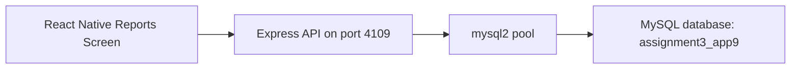
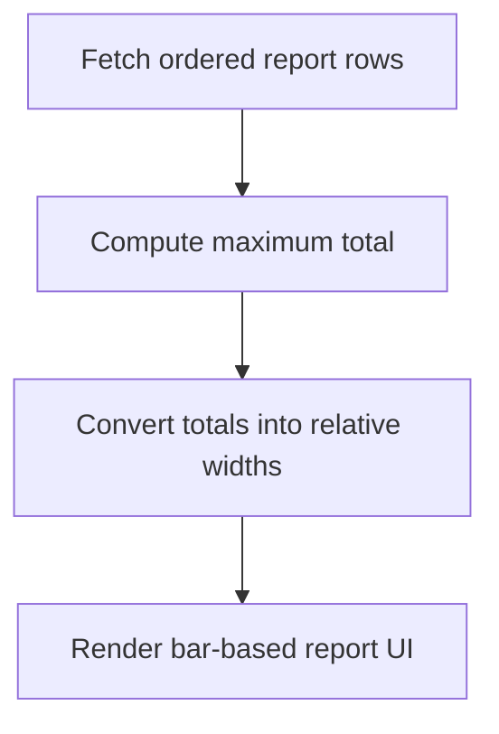

# Expense Tracker Reports App

## Overview

This project is a reporting screen for an expense tracker. It fetches monthly spending metrics from a MySQL-backed API and translates them into a simple visual bar-report layout optimized for mobile readability.

The emphasis here is data storytelling: instead of only listing records, the app turns backend values into a chart-like presentation that is useful for quick financial review.

## Architecture



## Key Features

- Fetches monthly spending data from MySQL
- Renders a proportional bar-style visualization in the mobile UI
- Highlights comparative month-to-month totals
- Keeps the backend focused on ordered reporting data
- Works as a standalone reports module

## Technology Stack

- React Native with Expo SDK 54
- Express.js
- mysql2
- MySQL via XAMPP

## API Contract

### `GET /reports`

Returns:

```json
[
  {
    "month_name": "Jan",
    "total": "420.00"
  }
]
```

## Database Design

Database: `assignment3_app9`

Table: `monthly_spending`

| Column | Type |
|---|---|
| id | INT, PK, AUTO_INCREMENT |
| month_number | INT |
| month_name | VARCHAR(20) |
| total | DECIMAL(10,2) |

## Reporting Pipeline



## Project Structure

```text
.
├── App.js
├── AppMain.js
├── server.js
├── sql2.sql
├── package.json
└── .gitignore
```

## Run Locally

1. Start MySQL in XAMPP.
2. Import [`sql2.sql`](./sql2.sql).
3. Run `npm install`
4. Run `node server.js`
5. Run `npx expo start -c`

Backend port: `4109`

## Engineering Notes

- The reporting UI intentionally avoids unnecessary charting dependencies while still communicating trends effectively.
- This project demonstrates how to transform raw backend metrics into a product-facing visualization.
